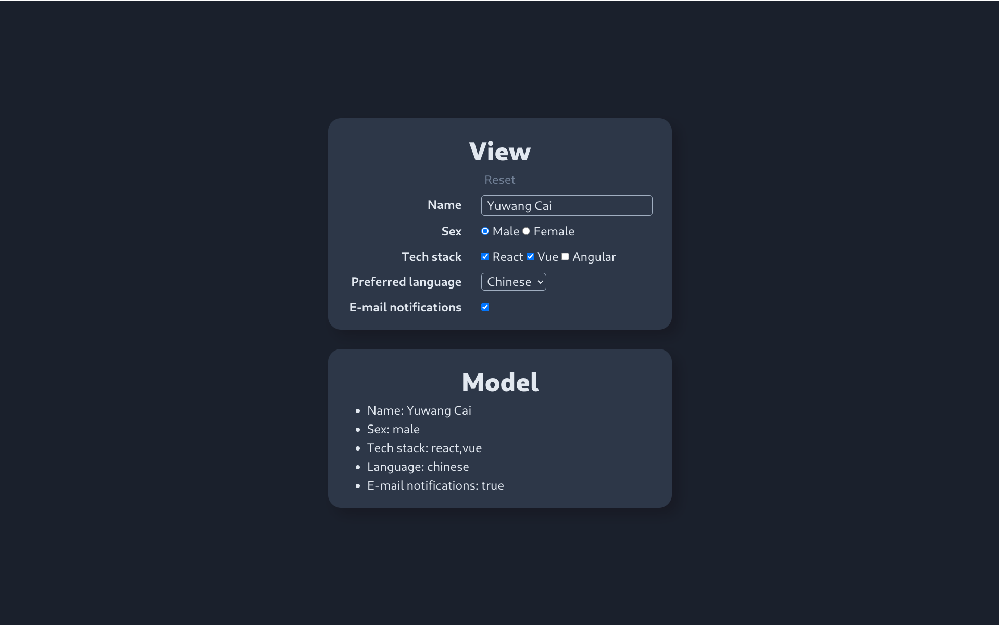

<div align="center">
  <a href="https://github.com/mrcaidev/cue" target="_blank" rel="noreferrer" hrefLang="en">
    
  </a>
  <h1>Cue</h1>
  <p>A minimal MVVM framework</p>
  <a href="https://github.com/mrcaidev/cue/wiki" target="_blank" rel="noreferrer" hrefLang="en"><strong>Explore the documentation 》</strong></a>
</div>

## ✨ Introduction

Cue - short for MrCai's Vue - is a light-weight MVVM framework. Features include:

- [x] Two-way binding between view and model. (Proxy + Subscribers)
- [x] Native TypeScript support.
- [x] Handy directives, e.g. `c-bind`、`c-on`、`c-model`.



## 🚀 Getting started

`@mrcaidev/cue` is available in npm registry.

```bash
npm i @mrcaidev/cue    # npm
yarn add @mrcaidev/cue # yarn
pnpm add @mrcaidev/cue # pnpm
```

For detailed usage, please refer to the [documentation](https://github.com/mrcaidev/cue/wiki).

## 🤝 Contributing

**Any contributions will be welcome and greatly appreciated.**

### Bug report

If something goes wrong, please [open an issue](https://github.com/mrcaidev/cue/issues) to help us improve.

### Feature request

If you have an idea of a new hook, or a better solution for an existing hook, please fork this repository and [create a pull request](https://github.com/mrcaidev/cue/pulls).

### Other feedback

You can always open an issue, or directly contact the author via [mrcaidev@qq.com](mailto:mrcaidev@qq.com).

## 📜 License

[MIT](https://github.com/mrcaidev/cue/blob/master/LICENSE)
